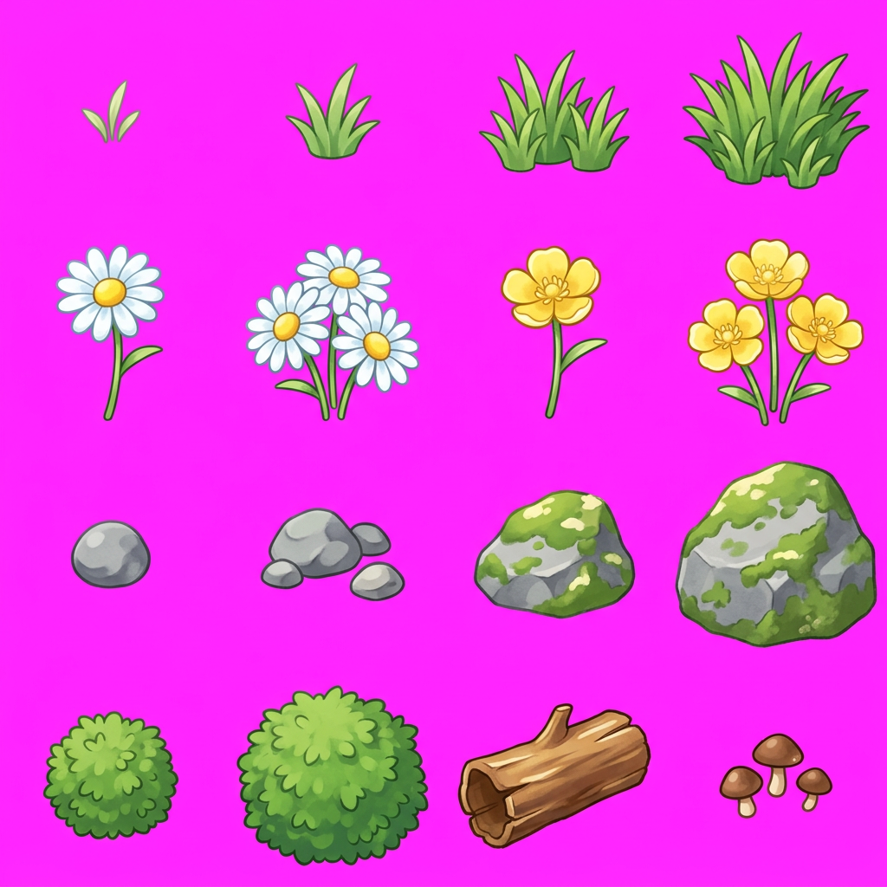
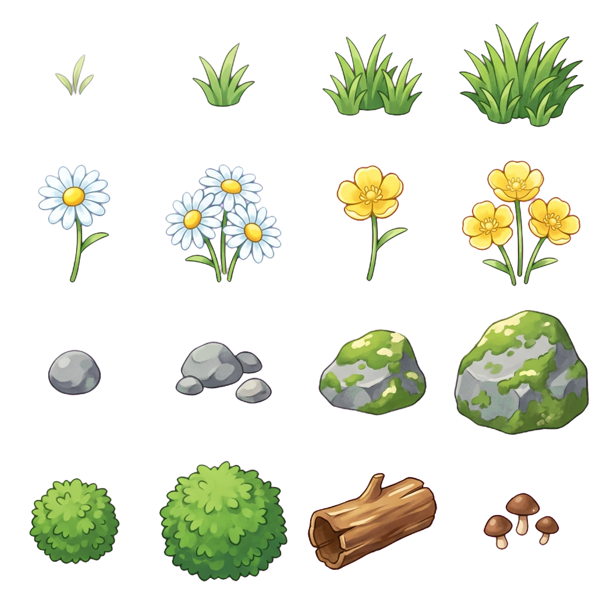

# ChromaPeel

[한국어](README.md) | **[English](README.en.md)**

A batch tool that makes a specific background color (chroma key) transparent in PNG images. It also cleanly removes color fringes on anti-aliased edges.

## Example

Result of processing a sprite sheet with a magenta `(255, 37, 255)` background.

| Before (input) | After (output) |
|:---:|:---:|
|  |  |
| Magenta background | Transparent background + fringe removed |

> The combination of Feather gradient + Color Decontamination + Edge Erosion cleanly handles even anti-aliased edges.

## Features

- **Drag-and-drop GUI** — drag PNGs into the window to register them, click the button to convert, then drag the result thumbnails out to Explorer
- Converts a target color to alpha (chroma key removal)
- **Feather gradient** — soft fade on edge pixels
- **Color Decontamination** — removes background-color tint from semi-transparent pixels
- **Edge Erosion** — fully removes residual fringe
- Batch folder processing (CLI mode)

## Requirements

- Python 3.8+
- Pillow, numpy, tkinterdnd2

## Installation

On Windows, double-click or run `setup.bat`:

```bash
setup.bat
```

It automatically:

1. Creates a `.venv` virtual environment (if missing)
2. Upgrades pip and installs dependencies
3. Creates `base/` and `alpha/` folders

## Usage

### GUI mode (recommended)

Double-click `run.bat` to launch the GUI.

1. Drag PNG files into the left **input panel**.
2. Click the **[Convert]** button in the middle.
3. Drag the thumbnails that appear in the right **result panel** out to Explorer / desktop to take them.

Expanding the "▸ Advanced Settings" toggle lets you adjust target color, tolerance, feather, edge erosion, and decontaminate from the GUI. Use "Reset to Defaults" to restore factory values at any time.

> Internally, inputs are staged in `base/` and outputs are saved to `alpha/`. The "Open Result Folder" button opens `alpha/` in Explorer.

### CLI mode

1. Put the PNG images to process into the `base/` folder.
2. Run the script:

```bash
.venv\Scripts\python.exe imageAlpha.py
```

3. Find the results in the `alpha/` folder.

## Parameters

Adjust via the advanced settings toggle in GUI mode, or via the `process_folder()` call at the bottom of `imageAlpha.py` in CLI mode.

| Parameter | Description | Default |
|-----------|-------------|---------|
| `input_dir` | Input folder | `"base"` |
| `output_dir` | Output folder | `"alpha"` |
| `target_color` | Color to remove (R, G, B) | `(255, 37, 255)` (magenta) |
| `tolerance` | Tolerance for full transparency | `20` |
| `feather` | Semi-transparent fade range | `100` |
| `decontaminate` | Remove background-color tint | `True` |
| `edge_erosion` | Number of erosion pixels on edges | `1` |

## How it works

1. **Distance calculation** — L∞ distance (per-channel max difference) between each pixel color and the target color
2. **Full transparency** — sets alpha to 0 where distance ≤ `tolerance`
3. **Feather fade** — sets alpha as a linear gradient across distance `tolerance`..`tolerance+feather`
4. **Decontamination** — removes target-color component from semi-transparent pixels by inverting the blend formula
   - `observed = t·target + (1-t)·original` → `original = (observed - t·target) / (1-t)`
5. **Edge Erosion** — erodes N pixels of opaque area adjacent to transparent regions using a 3×3 min filter

## Project structure

```
ChromaPeel/
├── .venv/              # Python virtual environment (git-ignored)
├── base/               # Input folder (auto-staged on GUI drop)
├── alpha/              # Output folder
├── chromapeel_gui.py   # GUI entry (Tkinter + tkinterdnd2)
├── imageAlpha.py       # Processing logic (also runs in CLI mode)
├── requirements.txt    # Python dependencies
├── setup.bat           # Windows auto-install script
├── run.bat             # One-click GUI launcher
└── .gitignore
```

## Tuning guide

| Symptom | Fix |
|---------|-----|
| Background-color fringe remains on edges | Increase `edge_erosion` to 2+, or increase `feather` |
| Thin features (grass blades, stems) disappear | Set `edge_erosion=0` to disable erosion |
| Sprite's own colors shift | Set `decontaminate=False` to disable decontamination |
| Background isn't fully removed | Increase `tolerance` |
